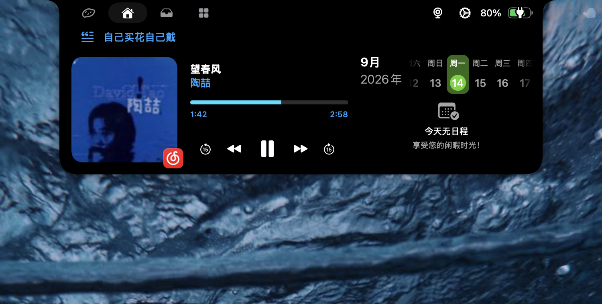
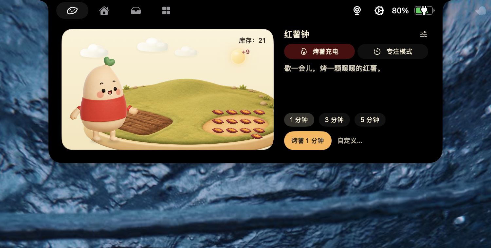
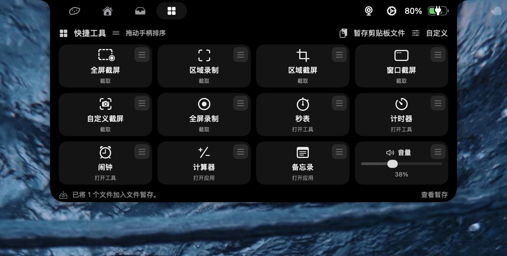

# 工位充电岛 · NotchIsland

**把 MacBook 的刘海变成一块能用的小岛。** 鼠标移上去就展开，里面有音乐控制与歌词、日历、音量／亮度提示、番茄钟、文件暂存，还有一整页系统快捷工具。

中文 · [English](README.en.md)


<p align="center"></p>

<!-- 截图位（补图后把下面几行的注释去掉即可）
<p align="center"></p>
<p align="center">
  
  
</p>
-->

**👉 第一次来？直接看 [下载安装](#一下载安装第一次用-github-也不会装错)，三步装好。**

---

## 目录

- [这是什么](#这是什么)
- [一、下载安装（第一次用 GitHub 也不会装错）](#一下载安装第一次用-github-也不会装错)
- [二、五分钟上手](#二五分钟上手)
- [三、功能详解](#三功能详解)
- [四、设置面板速查](#四设置面板速查)
- [五、常见问题](#五常见问题)
- [六、自己改代码 / 自行构建](#六自己改代码--自行构建)
- [七、已知限制](#七已知限制)
- [八、隐私](#八隐私)
- [九、许可证与致谢](#九许可证与致谢)

---

## 这是什么

一个原生 macOS 应用（SwiftUI + AppKit），常驻在屏幕顶部的刘海位置：

- **平时不占地方**：收起时就是那块黑色刘海，只在放音乐、计时、插拔电源时露出一点信息。
- **鼠标移上去就展开**：变成一块可交互的小面板，四个页面之间来回切。
- **不抢键盘焦点**：小岛永远不会变成"当前活跃窗口"，你在编辑器里打字时它不会打断你。

它基于开源项目 [boring.notch](https://github.com/TheBoredTeam/boring.notch)（GPL-3.0）二次开发，加了一只番薯角色「薯队长」和围绕它的番茄钟玩法，以及一整页系统快捷工具。

**运行要求**

| 项目 | 要求 |
|---|---|
| 系统 | macOS 15.0 或更高 |
| 机型 | Apple Silicon（M 系列）。Intel 机型未做验证 |
| 屏幕 | 有物理刘海的 MacBook 最合适；外接显示器 / 无刘海机型会用一个模拟的胶囊代替 |
| 价格 | 免费、开源，无账号、无内购、无广告 |

---

## 一、下载安装（第一次用 GitHub 也不会装错）

### 第 1 步：下载安装包

点这里 → **[前往最新版本下载页](../../releases/latest)**

页面往下滚，找到 **Assets**（中文界面写作「资源」）那一栏，点击名字像 `NotchIsland-1.0.0.dmg` 的文件即可开始下载。

> ⚠️ 同一栏里的 `Source code (zip)` / `Source code (tar.gz)` 是**源代码**，不是应用，普通使用不用下。

### 第 2 步：拖进「应用程序」

1. 双击下载好的 `.dmg` 文件，会弹出一个窗口。
2. 把窗口里的 **工位充电岛** 图标，拖到旁边的 **应用程序** 文件夹图标上。
3. 拖完后，在访达（Finder）左侧边栏找到那个白色磁盘图标，点它右边的 **⏏（推出）** 按钮，`.dmg` 就可以删掉了。

### 第 3 步：首次打开要手动放行（**这一步一定会遇到，别慌**）

这个应用**没有经过 Apple 公证（notarization）**——公证需要每年 99 美元的开发者账号，作者没有买。所以首次双击时 macOS 会拦下它，提示"无法验证开发者""可能是恶意软件"之类的话。**这不代表应用有问题，是所有未公证的开源应用都会遇到的关卡。**

放行步骤：

1. 在「应用程序」里双击 **工位充电岛**，会被拦下 → 先点「完成」或「好」关掉提示；
2. 打开 **系统设置 → 隐私与安全性**，向下滚到底部附近，会看到一行"已阻止 工位充电岛 的使用…"，点它右边的 **「仍要打开」**；
3. 系统再确认一次，点 **「打开」**（可能需要输入你的开机密码）。

放行一次以后，以后就是正常双击打开。

<details>
<summary>习惯命令行的话，也可以这样（点击展开）</summary>

在「终端」里执行下面一行，直接去掉隔离标记：

```sh
xattr -dr com.apple.quarantine /Applications/工位充电岛.app
```

这等于你自己承担"跳过 Gatekeeper 校验"的风险，请确认 `.dmg` 是从本仓库的 Releases 页下载的。

</details>

### 第 4 步：给权限（按需给，不给也能用一部分）

第一次启动会有一个引导页问你要不要开权限；错过了也没关系，随时可以去 **系统设置 → 隐私与安全性** 里手动开。

| 权限 | 给了以后能用什么 | 不给会怎样 |
|---|---|---|
| **辅助功能** | 音量／亮度／静音提示改在刘海显示；把其它 App 的通知横幅转显到刘海；锁屏工具；文件暂存的 ⌘C／⌘X／⌘V | 这几项静默不可用，其余功能正常 |
| **屏幕录制** | 截屏、录屏工具 | 截屏／录屏不可用 |
| **日历 / 提醒事项** | 小岛主页里的日程与提醒列表 | 该区域为空 |
| **摄像头** | 主页的「镜子」（临时照个镜子用） | 镜子不可用 |
| **通知** | 秒表 / 计时器 / 闹钟到点提醒 | 到点不弹通知 |
| **自动化（System Events）** | 快捷工具里的「深色模式」直接切换 | 该项会显示失败 |

> 改了辅助功能权限后，建议退出应用再重新打开一次，状态最干净。

### 第 5 步（可选）：开机自动启动

菜单栏红薯图标 → **设置…** → **通用** → 打开「登录时启动」。

---

## 二、五分钟上手

### 怎么打开、怎么关掉

| 想干什么 | 怎么做 |
|---|---|
| 展开小岛 | 鼠标移到刘海上，停约 0.15 秒就展开；移开约 0.1 秒收起 |
| 用键盘展开／收起 | 默认 **⇧⌘I**（可在 设置 → 快捷键 里改） |
| 从菜单栏展开 | 点菜单栏的红薯图标 → 「打开小岛」 |
| 临时藏起小岛（比如要投屏演示） | 菜单栏红薯图标 → 「隐藏小岛」；再点一次恢复 |
| 打开设置 | 菜单栏红薯图标 → 「设置…」，或应用在前台时按 **⌘,** |
| 退出 | 菜单栏红薯图标 → 「退出」 |

> **只有系统真正的那块物理刘海矩形能触发展开。** 音乐两翼、歌词行、加宽的提示条都只是画出来的，把鼠标放在那些地方不会展开小岛——这是刻意的设计，避免你去点菜单栏时小岛乱弹。

### 展开后有四个页面

顶部一排小图标就是页面切换（默认**鼠标扫过图标即切页**，可在 设置 → 外观 里关掉）：

| 页面 | 里面有什么 |
|---|---|
| 🍠 **小岛** | 薯队长的小农场 + 红薯钟（番茄钟）。收成的红薯会堆在地上 |
| 🏠 **工具主页**（默认落地页） | 正在播放的音乐（封面、进度、上一首／播放／下一首）、日历与提醒、镜子、文件暂存入口 |
| 📥 **文件暂存** | 一个临时放文件的托盘，拖进拖出 |
| ⊞ **快捷工具** | 一整页系统快捷开关与小工具，可自选显示哪些、怎么排 |

### 收起状态下，刘海上会显示什么

- 放音乐时：刘海两侧长出封面缩略图 + 跳动的频谱（可在 设置 → 媒体 关掉）；
- 开着歌词时：刘海**下方**多一行同步歌词；
- 红薯钟运行时：显示一个红薯图标和剩余时间；
- 调音量／亮度／静音时：提示直接画在刘海上，替代系统右上角那个大方块；
- 插／拔电源时：刘海上闪一下充电提示。

### 两个悬浮小圆钮

小岛展开后，右上方刘海外侧会浮出两个小圆钮：上面那个是**收起小岛**，下面那个是**清空文件暂存区**（暂存区为空时是灰的）。

---

## 三、功能详解

### 1. 音乐与歌词

- **控制**：主页显示当前播放的封面、歌名、艺人、进度条，可上一首／播放暂停／下一首；按钮的位置和数量可以在 设置 → 媒体 → 媒体控制 里拖着调整。
- **歌词**：**歌词不是从播放器里读出来的**——macOS 只会把标题、艺人、专辑、时长、进度告诉第三方应用，没有歌词字段。所以本应用是拿这些信息去**网易云公开接口和 LRCLIB 联网匹配 LRC 歌词**，再按播放进度在本地推算时间轴。
  - 位置可选：关闭 / 显示在播放器里 / 显示在刘海下方（设置 → 媒体 → 歌词位置）。
  - 颜色可选：白色 / 跟随专辑封面 / 自定义颜色。
  - 长句会滚动；暂停、没匹配到歌词、纯间奏时自动收起。
  - **匹配是有门槛的**：标题、专辑、时长（差 ≤1 秒）、主艺人都要对得上才用，宁可不显示也不给你一份错的时间轴。冷门歌、现场版、翻唱经常匹配不到，属正常。
  - 用网易云播放时优先用网易云的歌词；其它播放器（QQ 音乐 / 酷狗 / Spotify / Apple Music）优先 LRCLIB。**非网易云播放器的效果作者本人没有实测过**，遇到偏几秒的情况欢迎提 issue。

### 2. 系统提示（HUD）

调**内置键盘**的音量、亮度、静音键时，把系统右上角那个半透明大方块换成刘海上的细条提示。

- 两种样式：**默认**（刘海下方一条 28 点高的提示行）和**内嵌**（画在摄像头两侧）。
- 需要**辅助功能**权限；没授权时会退回系统原生提示，不会两个同时出现。
- 设置 → HUDs 里有一段只读诊断信息（进程路径、签名、授权状态、最近的媒体按键事件），排查问题时可以整段复制出来贴到 issue 里。

### 3. 红薯钟（番茄钟）

在 🍠 页面。分「专注」和「休息」两种，同一时间只能跑一种。

- **专注**：默认 25 分钟，可设 1–120 分钟。中间是圆环 + 剩余时间，薯队长会分六口把一颗烤红薯吃掉。完成消耗一颗库存；库存为 0 也能跑（试吃），不会欠账。
- **休息**：默认 1 分钟，可设 1–120 分钟。前半段松土、浇水、拔薯，后半段翻烤；**每完成一分钟收一颗红薯**存进库存。
- 支持暂停／继续、提前结束（已完成的整分钟保留，不满一分钟不算）。
- **合上盖子、锁屏、退出应用都不会改变结束时间**：下次打开会按真实经过的时间补算收成。
- 农场最多画 12 颗红薯（三排四颗），多出来的显示 `+N`，数字始终是全部库存。
- 专注结束时小岛会自己展开提醒一次，至少留 10 秒让你看见；**不响铃、不抢焦点**，下一轮要你自己点开始。
- 设置 → 红薯钟 里可以关掉「在收起的刘海上显示倒计时」——关掉后计时照跑照结算，只是刘海上不显示。

### 4. 文件暂存

一个临时托盘，用来接力传文件：从访达拖进来，回头再拖到微信、邮件、网页里。

- **进来的路**：直接拖进小岛；应用内截屏／录屏的产物自动进来；你按 **⇧⌘3 / ⇧⌘4** 拍的系统截图会被自动复制一份进来（**原图仍在桌面，不动你的文件**）；还可以用「暂存剪贴板文件」按钮把剪贴板里的东西存进来。
- **出去的路**：直接拖出到目标应用。按住组合键（默认 **⌥⌘**，可改）再拖，则**拖出即移除**。
- **误删有救**：移除后会出现「已移出 · 撤销」的小条，10 秒内可以点回来。清空暂存区同理。
- 支持多选（⌘ 点选）、⌘C／⌘X／⌘V（需辅助功能权限）、右键菜单（打开 / 复制 / 剪切 / 移除 / 粘贴）。
- **自动清理**：每个文件从进入时独立计时，可选不清理 / 12 小时 / 1 天 / 3 天 / 1 周（默认 1 天）。到期时**只有本应用自己在临时目录里生成的文件**（截图、录屏、剪贴板图片等）会真删；从访达拖进来的条目只是从列表里消失，**磁盘上的原文件不动**。

### 5. 快捷工具页

一整页磁贴，**共 73 项**，可在 设置 → 快捷工具 里勾选显示哪些、并按住三横线手柄拖着排序。

请留意这些磁贴的性质**不一样**（磁贴副标题上都写明了）：

| 类型 | 数量 | 说明 |
|---|---:|---|
| 打开系统设置的入口 | 35 | 点了是**跳转到对应的系统设置页**，不是直接开关（专注模式、VPN、台前调度、各类辅助功能选项等） |
| 打开系统自带应用 | 13 | 时钟、计算器、备忘录、语音备忘录、快捷指令、天气、家庭、提醒事项、放大镜、聚焦、Siri、屏幕保护、辅助功能快捷键 |
| 截屏 / 录屏流程 | 7 | 全屏 / 区域 / 窗口 / 自定义截屏，全屏 / 区域 / 自定义录屏。产物自动进文件暂存。**仅画面，不录系统音频和麦克风** |
| 应用内小工具 | 3 | 秒表、计时器、闹钟（独立小窗，关掉窗口也继续计时，到点发通知） |
| 岛内滑块 | 3 | 音量、屏幕亮度、键盘背光，直接拖着调真实硬件 |
| 直接开关 / 直接选择 | 9 | 静音、Wi-Fi 开关、深色模式、时间机器备份、锁屏、输入法切换、音频输出设备切换、显示分辨率/刷新率切换、跳回播放器主页 |
| 标注「实验」的 | 3 | **蓝牙、夜览、原彩显示**。这三项走的是系统私有接口，不同机器上可能读不到状态或切换失败；失败时会明确告诉你，并给一个跳系统设置的备选路径，不会假装成功 |

作者对上面这些的真实验收程度不一样：夜览、增加对比度、降低透明度、音频输出切换、输入法、显示模式切换、蓝牙开关、区域录屏、拖动排序**已在真机上逐项点过**；VPN 连接／断开、时间机器真实启停因为作者机器上没有相应配置**没能验证**；13 个"打开系统应用"只验证过路径能解析。

### 6. 应用通知转显

把**任意 App 的桌面通知横幅**转显到刘海上，点一下可以跳去对应应用。

- 需要**辅助功能**权限。
- 一个 App 发出第一条通知后，它就会自动出现在 设置 → 应用通知 的列表里，你可以**逐个 App 开关**，并单独控制**是否显示内容预览**（不显示预览时只告诉你"某某来消息了"）。
- 作者已在真实的微信、企业 IM 横幅上验证过转显和点击打开。
- ⚠️ **系统原来的横幅不会被隐藏**，所以目前是"两处都会出现"；"隐藏原横幅""横幅跟随小岛所在屏幕"都还没做。

### 7. 日历、提醒与镜子

主页右侧是日历与提醒（分别单独申请权限，可在 设置 → 日历 里选择显示哪些日历）。主页还有一个「镜子」，点开就是前置摄像头的画面，用完就停——**只在你点开时才启动摄像头**（不需要的话可在 设置 → 外观 里关掉）。

### 8. 电池与电源提示

插拔电源线时刘海上给一条提示，外形和音量提示一致（跟随你选的默认／内嵌样式）。可在 设置 → 电池 里关掉。

### 9. 外观、图标与语言

- **界面语言**：设置 → 通用 → Language，中文／English 即时切换。
- **应用图标**：设置 → 高级里可切换「薯队长 / 种红薯 / 烤红薯」三款。
- 打开系统的"减弱动态效果"后，薯队长的动画会自动退化成静态画面。

---

## 四、设置面板速查

菜单栏红薯图标 → 「设置…」，左侧一共这些分区（右上角有搜索框）：

| 分区 | 主要管什么 |
|---|---|
| **通用** | 语言、登录时启动、显示菜单栏图标、小岛显示在哪块屏幕 |
| **红薯钟** | 专注／休息时长、收起态是否显示倒计时 |
| **快捷工具** | 73 项工具里显示哪些、顺序 |
| **外观** | 刘海行为：悬停展开开关、收起方式与延迟、悬停切换标签页与延迟、触感反馈、记住上次标签页、镜子开关 |
| **媒体** | 刘海媒体两翼、歌词位置与颜色、媒体控制按钮布局、专辑封面辉光 |
| **应用通知** | 哪些 App 的通知转显、是否显示内容预览 |
| **日历** | 显示哪些日历、提醒事项开关 |
| **HUDs** | 音量／亮度提示是否接管、默认或内嵌样式、只读诊断信息 |
| **电池** | 电源提示开关 |
| **文件暂存** | 是否启用、有文件时是否默认落在暂存页、拖出即移除的组合键、自动清理时长 |
| **快捷键** | 展开／收起小岛、快速媒体提示的全局快捷键 |
| **高级** | 应用图标等 |
| **关于** | 版本、开源来源 |

---

## 五、常见问题

<details open>
<summary><b>双击打不开，提示"无法验证开发者 / 可能是恶意软件"</b></summary>

正常现象，因为没有 Apple 公证。按 [第 3 步](#第-3-步首次打开要手动放行这一步一定会遇到别慌)去「系统设置 → 隐私与安全性 → 仍要打开」放行一次即可。macOS 15 之后 Apple 已经取消了老办法（按住 Control 点图标 → 打开），请走系统设置这条路。
</details>

<details>
<summary><b>装好了，但刘海上什么都没有 / 鼠标移上去没反应</b></summary>

依次检查：

1. 应用在运行吗？菜单栏应该有一个红薯图标。没有的话去「应用程序」双击打开（如果你关掉了菜单栏图标，重新打开应用会自动弹出设置窗口）。
2. 是不是按过「隐藏小岛」？菜单栏图标 → 点「显示小岛」。
3. 鼠标要停在**刘海本身**上，不是刘海旁边的菜单栏空白处，也不是小岛画出来的两翼。
4. 设置 → 外观 → 刘海行为 里的「悬停展开刘海」是不是被关掉了？（关掉后只能用快捷键或菜单栏展开）
5. 你的 Mac 有物理刘海吗？外接屏 / 无刘海机型会在屏幕顶部中央用一个模拟胶囊代替，位置略有不同。
6. 多屏用户：设置 → 通用 里可以指定小岛显示在哪块屏幕（也有「在所有屏幕显示」开关）。

如果反过来是**太容易收起**（鼠标稍微划过边缘就收了），在 设置 → 外观 → 刘海行为 里把「收起延迟」调大一点。
</details>

<details>
<summary><b>调音量／亮度时，右上角还是系统原来的大方块</b></summary>

这个功能需要**辅助功能**权限：系统设置 → 隐私与安全性 → 辅助功能 → 打开「工位充电岛」，然后退出应用重开。设置 → HUDs 页会显示当前是"已启用 / 未授权 / 启动失败"，照着上面的提示处理。另外它接管的是**内置键盘**的音量／亮度／静音键。
</details>

<details>
<summary><b>歌词不显示 / 歌词不同步</b></summary>

- 先确认 设置 → 媒体 → 歌词位置 不是"关闭"。
- 歌词是联网匹配的，需要网络。
- 标题、专辑、时长、主艺人四项都对得上才会用，所以现场版、翻唱、冷门曲、无损版本号奇怪的曲目经常匹配不到——这是"宁可不显示也不给错的"的取舍。
- 用网易云播放最稳。其它播放器走 LRCLIB，可能出现偏几秒的转写版本。
</details>

<details>
<summary><b>其它 App 的通知没有转显到刘海</b></summary>

1. 需要**辅助功能**权限。
2. 该 App 需要先真实发出过一条通知，之后它才会出现在 设置 → 应用通知 的列表里，然后手动打开它的开关。
3. 该 App 自己的通知得是系统横幅样式（在系统设置 → 通知里没有被设成"无"）。
4. 顺带说明：系统原来的横幅**目前不会被隐藏**，两处同时出现是当前版本的已知状态。
</details>

<details>
<summary><b>截屏／录屏点了没反应</b></summary>

需要**屏幕录制**权限：系统设置 → 隐私与安全性 → 屏幕录制 → 打开「工位充电岛」，然后**退出应用重开**（这个权限必须重启应用才生效）。录屏只录画面，不含系统声音和麦克风。
</details>

<details>
<summary><b>怎么更新到新版本？</b></summary>

**没有自动更新**（自动更新同样需要付费开发者账号来签名）。想升级就回到 [Releases](../../releases/latest) 下载新的 `.dmg`，覆盖安装即可；你的番茄钟库存、设置、暂存区都保留。覆盖前先退出正在运行的应用。

想第一时间知道有没有新版：点仓库右上角 **Watch → Custom → Releases**，有新版本时 GitHub 会通知你。
</details>

<details>
<summary><b>怎么完全卸载？</b></summary>

1. 菜单栏红薯图标 → 退出。
2. 把「应用程序」里的 **工位充电岛** 拖到废纸篓。
3. （可选）清掉留在本机的数据：
   ```sh
   rm -rf ~/Library/Application\ Support/boringNotch
   defaults delete com.dongfengrui.NotchIsland
   ```
4. （可选）去 系统设置 → 隐私与安全性 → 辅助功能 / 屏幕录制 里，把已经不存在的条目用「−」移掉。
</details>

<details>
<summary><b>能和原版 boring.notch 一起装吗？</b></summary>

能装在一起（两者是不同的应用，互不覆盖），但**别同时运行**——两个应用会在同一块刘海上叠两个窗口，交互会互相打架。用其中一个时请退出另一个。
</details>

<details>
<summary><b>会上传我的数据吗？</b></summary>

不会，见 [隐私](#八隐私) 一节。
</details>

---

## 六、自己改代码 / 自行构建

```sh
git clone https://github.com/eDouFuRu/notch-island.git
cd notch-island
open boringNotch.xcodeproj
```

在 Xcode 里选 **NotchIslandNext** scheme，把签名改成你自己的账号或「Sign to Run Locally」，然后 Build & Run。需要 Xcode 16+ 与 macOS 15 SDK。

不用开 Xcode 也能跑的检查：

```sh
swift test                              # 纯逻辑单元测试（计时、状态机、歌词匹配等）
./scripts/test-services.sh              # 服务层检查（假实现，不碰真实硬件）
python3 scripts/audit-localization.py   # 中英词条一致性
```

代码分层约定：`boringNotch/Interaction/Core/` 与 `boringNotch/components/Island/Core/` 是不依赖 AppKit／SwiftUI 的纯逻辑内核（可单测），外层负责调系统 API 和画界面。加功能时请照这个分法拆。

> 发布版二进制是用作者本机的自签证书签的，那套脚本涉及本机钥匙串，没有放进这个仓库。

<details>
<summary><b>关于代码里那个企业内部 IM</b></summary>

代码里对一款企业内部 IM（bundle id `com.electron.redcity`）做了通知解析适配，因为作者公司在用它。对其他人来说这只是一条多余的适配规则，不影响任何功能，也不会向外发送任何数据。
</details>

---

## 七、已知限制

- **没有 Apple 公证**，首次打开需手动放行。
- **没有自动更新**，新版本要回 Releases 手动下载。
- 只在 **Apple Silicon** 上构建和验证过，Intel 机型未知。
- 触发区固定为系统提供的物理刘海矩形；无刘海机型用模拟胶囊，手感不同。
- 应用通知转显时，**系统原来的横幅不会被隐藏**。
- 蓝牙 / 夜览 / 原彩显示三项走系统私有接口，标注为「实验」，不同机型可能不可用。
- 快捷工具里 35 项只是"打开对应系统设置页"，不是直接开关。
- 非网易云播放器的歌词效果作者未实测。
- 不上 App Store（用到了 MediaRemote 等私有框架，且未开启沙盒）。

---

## 八、隐私

- 应用**不收集、不上传任何个人数据**：番茄钟记录、暂存的文件、通知内容、设置都只保存在你自己的电脑上（`~/Library/Application Support/boringNotch/` 与本应用的偏好设置）。
- **唯一的联网行为**是歌词匹配：把当前播放歌曲的标题／艺人／专辑／时长发给网易云公开接口和 LRCLIB 去查 LRC 歌词。把 设置 → 媒体 → 歌词位置 设为"关闭"即可完全不联网。
- 通知转显只在本机内读取横幅上的文字用于显示，不做任何上传或落盘留存。
- 镜子只在你点开时启动摄像头，收起即停止。

---

## 九、许可证与致谢

本项目以 **GPL-3.0** 授权，与上游保持一致：你可以自由使用、修改、再分发，但衍生作品必须同样开源并保留许可证。

- 上游项目：[TheBoredTeam/boring.notch](https://github.com/TheBoredTeam/boring.notch)，本项目基于其提交 `16b0f11f51c79d42e27c10d77fd9e53c11410fdb`（v2.7.3）。感谢上游作者们。
- 许可证全文见 [LICENSE](LICENSE)，第三方组件声明见 [THIRD_PARTY_LICENSES](THIRD_PARTY_LICENSES)，上游原始说明见 [docs/upstream/README-boring-notch.md](docs/upstream/README-boring-notch.md)。
- 版本变化见 [CHANGELOG.md](CHANGELOG.md)。

**关于角色形象**：「薯队长」的插画与 2.5D 贴图是为本项目生成的原创素材。本项目是个人业余作品，与任何公司无关，也未获得任何公司背书。如果你认为其中某个素材侵犯了你的权利，请提 issue，我会撤下或替换。

有问题、有建议、发现 bug，欢迎开 [issue](../../issues)。
